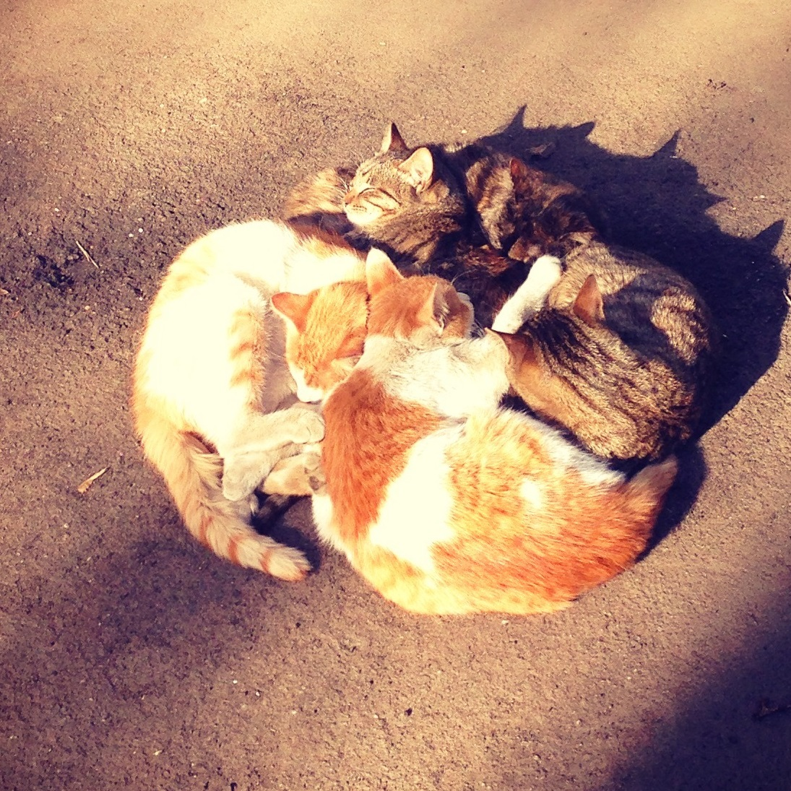

# The Enkrates Cookbook

_Temporary crutches for eternal goodness._

* Энкрат (от гр. _ἐγκρᾰτής/enkratês_) – человек, обладающий способностью самоконтроля, т.е. качеством энкратии.
* [Энкратия](https://en.wikipedia.org/wiki/Enkrateia) (_ἐγκράτεια_) – «(пребывание) во власти (над собой)»; состояние, в котором совершаются действия из лучших побуждений. Это понятие образовано учениками Сократа от прилагательного _enkratês_ – «владеющий»: пребывание во власти, исходящей изнутри личности. Это противоположность акразии (_ἀκρασία_) – отсутствию управления над собой и склонности поступать вопреки лучшим (основанным на ценностях и убеждениях) порывам.
    * Два этих термина введены, чтобы легче описывать продуктивные и непродуктивные стратегии, опираясь не на формальные признаки и ассоциации («прокрастинация», «дисциплина»), а на побуждения в основе действий. Для того, чтобы «лучшие побуждения» действительно приводили к лучшим выборам, необходимо уметь не только исполнять намерения (самоконтроль), но также понимать свои цели и ценности (самопонимание); для обоих этих задач следует уметь пользоваться своим мышлением (метапознание).
* ЭНКРАТОМ – совокупность привычных паттернов оценивания, реагирования и самоподкрепления успешных людей, который отдельные прокрастинаторы пытаются восстановить по биографии. ЭНКРАТОМИКА – дисциплина, предметом исследования которой является энкратом.
    * Enkratome is a (not yet) comprehensive map of behavioral patterns and interconnections thereof observable in a decent human being. Enkratomics is the art and science of managing one's life better via applying one's limited cognitive control resource optimally by copying parts of the enkratome.
    * На самом деле, шутеечка на мотив «коннектома».
* ЭНКРАТОМИКА – саморазвитие агента в условиях ограниченного ресурса самоконтроля.
    * https://t.me/enkratomics – конференция в Telegram для тех, кому не нравится быть акратом.
    * На самом деле, шутеечка на мотив погибшей конфы «Хиккиномика» про выживание в статусе депрессивного безработного социофоба.
* Эта книга – попытка реконструкции энкратома на более серьёзном уровне, чем шуточный. Это поваренная книга энкрата. 
* Котики:
